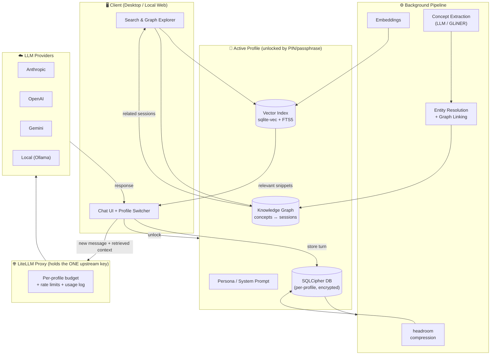
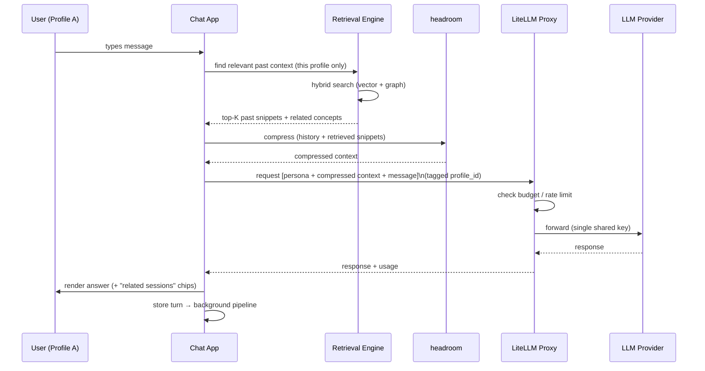
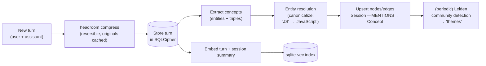
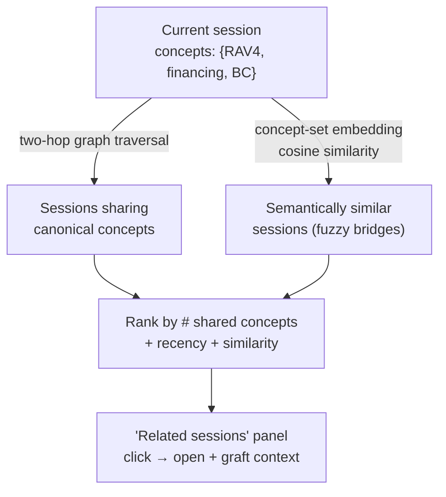
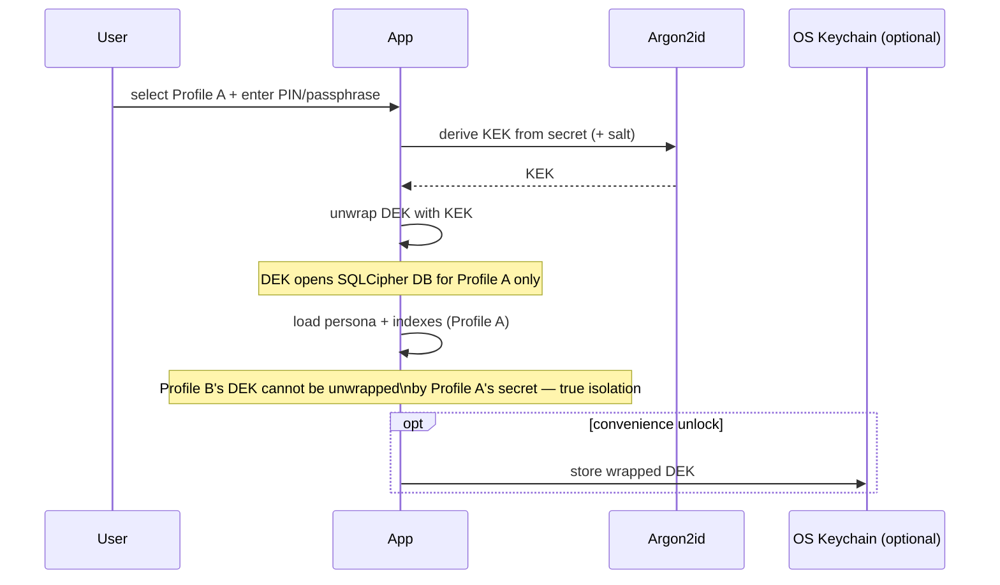
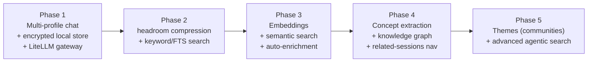
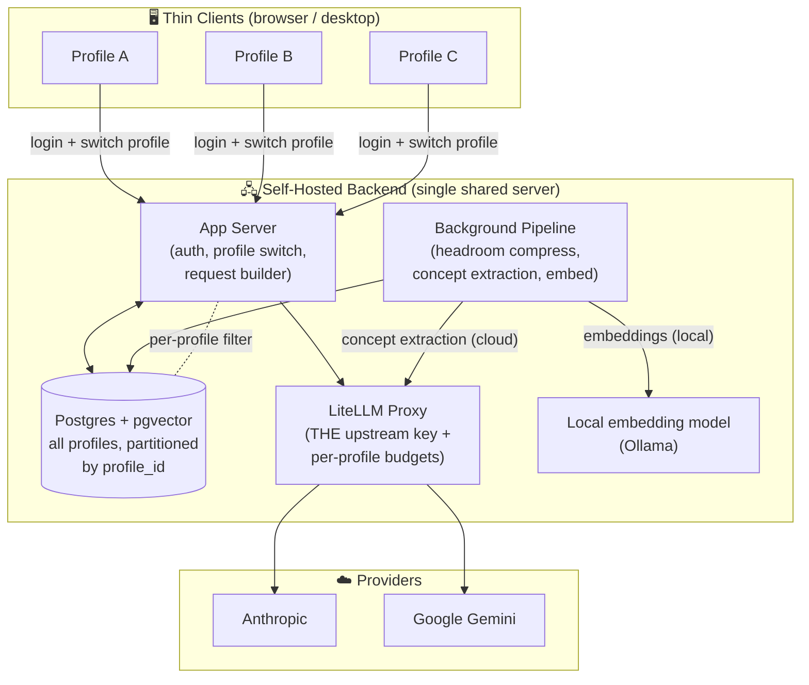
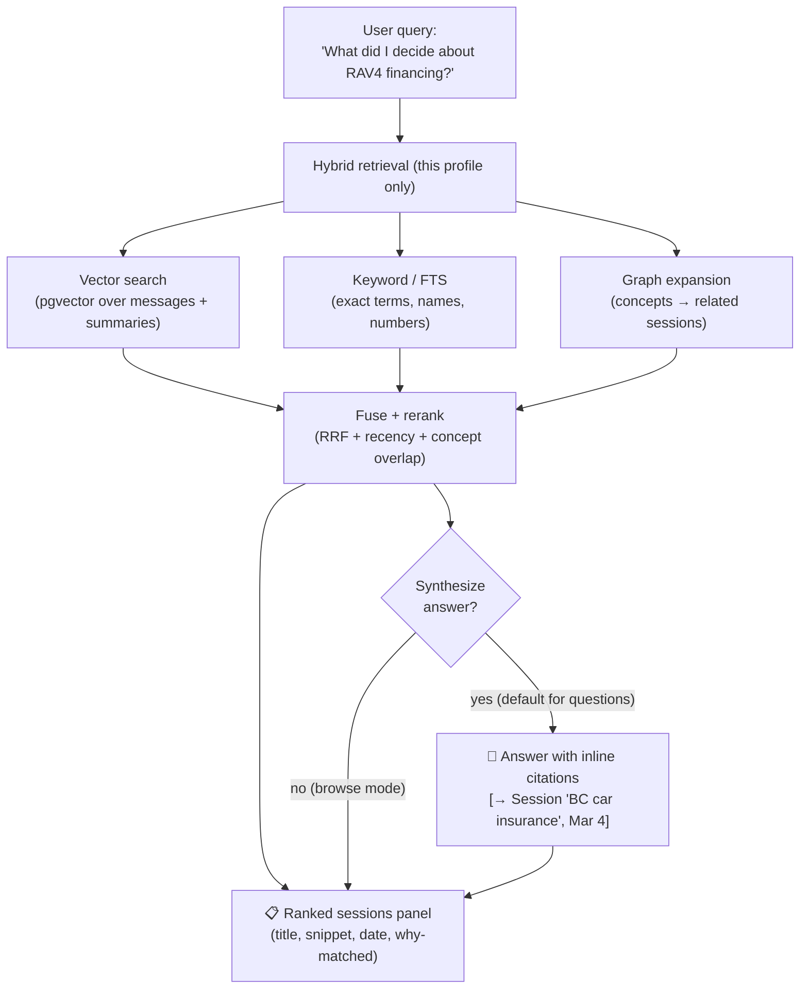
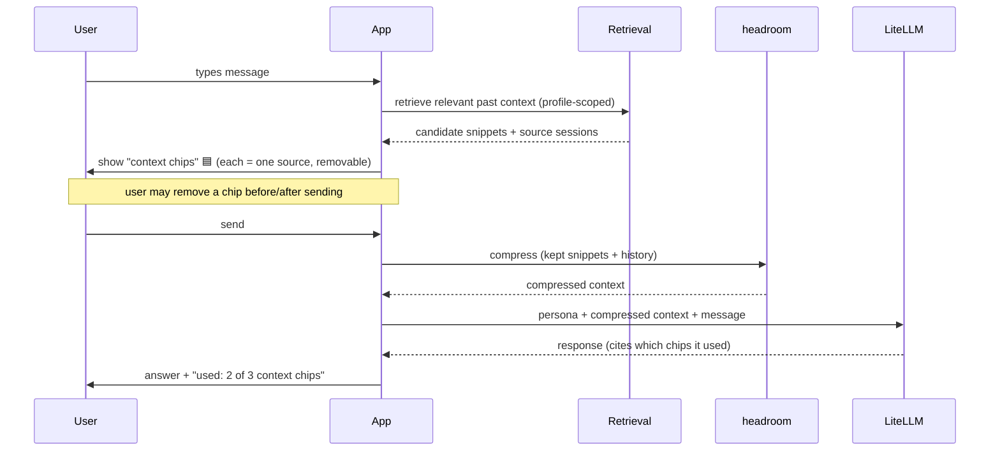

# Personal Claude — A Multi-Profile, Memory-Augmented Chat Workspace

> **Working name:** *Personal Claude* (placeholder)
> **One-liner:** A local-first chat client that lets several people share a single LLM account while staying fully isolated from one another — each profile gets its own private, compressed, searchable conversation history that is woven into a personal knowledge graph so past sessions enrich new ones automatically.

---

## 1. The Idea in Plain Words

You have *one* upstream AI account (an Anthropic / OpenAI / Gemini **API key**, or several). You want multiple people — family members, teammates, or just different "modes" of yourself — to use it without seeing each other's conversations.

On top of that, every conversation should:

1. **Persist locally** and be **compressed** (via [`headroom`](https://github.com/chopratejas/headroom)) so history is cheap to store and cheap to re-feed to the model.
2. Be **searchable** by its owner — not just keyword search, but *semantic* "find me that chat where we figured out X."
3. Be **linked into a knowledge graph** of concepts, so the system knows that the "RAV4 financing" chat and the "BC car insurance" chat are about related things — and can hop between them.
4. **Enrich new sessions automatically**: when you start talking about a topic, the app pulls compressed, relevant snippets from your *own* past sessions and injects them as context — a private, personal RAG over your life's conversations.

The four pillars:

| Pillar | What it does | Built on |
|---|---|---|
| **🔐 Profiles & Access Control** | Multiple isolated identities sharing one upstream account | Envelope encryption + LiteLLM proxy |
| **🗜️ Compressed Local Memory** | Every turn stored locally, compressed 60–95% | `headroom` |
| **🕸️ Knowledge Graph** | Concepts extracted per session, linked across sessions | Graphiti-style temporal KG / DIY SQLite graph |
| **🔍 Semantic Search & Recall** | Natural-language search + auto-enrichment of new chats | Hybrid vector + graph retrieval |

---

## 2. What Already Exists (Research Findings)

I surveyed the landscape across three axes. The headline: **no existing tool combines all four pillars** — which is exactly the opening for this project.

### 2.1 Multi-LLM chat front-ends

| Tool | Multi-user | Shared key | Storage | History search | Knowledge graph | License |
|---|---|---|---|---|---|---|
| **LibreChat** | ✅ RBAC | ✅ | Server (Mongo) | Full-text (Meilisearch) | ❌ | MIT |
| **Open WebUI** | ✅ Groups | ✅ | SQLite/Postgres | Lexical (Cmd+K) | ❌ | BSD-3 + branding |
| **AnythingLLM** | ✅ Workspaces | hybrid | SQLite + LanceDB | weak | ❌ | MIT |
| **Lobe Chat** | ✅ | ⚠️ no isolation | PGlite / Postgres | roadmap | ❌ | custom |
| **Jan / BigAGI / Chatbox** | ❌ single-user | BYOK | local | weak | ❌ | Apache/MIT/GPL |

**Key takeaways:**
- *Local-first* and *true multi-profile* currently pull in opposite directions — local tools are single-user; multi-user tools are server-backed. **Combining them is novel.**
- **Search over chat history is universally weak** — where it exists, it's keyword, never semantic. (RAG in these tools = over *uploaded docs*, not conversations.)
- **No tool ships a knowledge graph** over conversations. Both are differentiation opportunities.
- Best primitives to borrow: **AnythingLLM "Workspaces"** (per-profile isolation), **Lobe Chat's PGlite** (real DB in the browser), **BigAGI Personas** (persona authoring UX), **Open WebUI "Models"** (persona-as-config).

### 2.2 Memory & knowledge-graph engines

| System | KG? | Retrieval | Local? | License | Fit |
|---|---|---|---|---|---|
| **Graphiti / Zep** | ✅ temporal, incremental | hybrid vector+BM25+graph BFS, **node-distance rerank** | ✅ (needs Neo4j/FalkorDB) | Apache 2.0 | **Strongest fit** |
| **Cognee** | ✅ | hybrid, 15+ search types | ✅ by default (LanceDB+Kuzu+SQLite) | Apache 2.0 | Batteries-included local |
| **Mem0** | optional | vector → hybrid | configurable | Apache 2.0 | Drop-in memory, JS+Py SDK |
| **MS GraphRAG** | ✅ Leiden communities | global/local/DRIFT | ✅ batch | MIT | Periodic "themes" job |
| **Letta/MemGPT** | ❌ vector only | vector + recall | ✅ | Apache 2.0 | Full agent runtime |
| **Basic Memory** | ✅ wikilinks | FTS+semantic+graph | ✅ (Markdown+SQLite) | AGPL-3.0 | Human-readable, Obsidian |

**The "navigate to related sessions via shared concepts" feature** is a known, solved pattern:
- Model `Session —MENTIONS→ Concept ←MENTIONS— Session`. Two-hop traversal finds related sessions; rank by # of shared canonical concepts (Graphiti's **node-distance reranker** does exactly this).
- Combine with an **embedding path**: embed each session's concept-set / summary, link by cosine similarity to catch fuzzy bridges entity-resolution missed.
- Hybrid graph + vector = the GraphRAG retrieval pattern.

**Concept-extraction pipeline (canonical):** chunk → LLM extracts entities + (subject, predicate, object) triples against a schema → resolve/dedupe (n-gram TF-IDF on names + embedding on descriptions) → store nodes/edges → embed → optional Leiden community detection for "themes."

### 2.3 Sharing one account safely (the two load-bearing constraints)

> ⚠️ **Legal:** Sharing one *consumer subscription login* (Claude Pro/Max, ChatGPT Plus, Gemini Advanced) among multiple people **violates the ToS of all three providers.** Sharing one **API key** to power your own app for multiple end-users **is explicitly sanctioned** by their commercial/business terms. **➡ Build on the API, not on a shared consumer login.**

> ⚠️ **Isolation:** On a shared OS account, no software scheme stops one same-OS process from eventually reading another profile's data **unless decryption is gated behind a per-profile secret** (PIN / passphrase / passkey) each session. The OS keychain alone is *not* enough on Windows/Linux.

**Recommended sharing stack:**
- One upstream **API key** held server-side in a self-hosted **LiteLLM Proxy** (the only OSS option covering per-user virtual keys + budgets + RPM/TPM limits + spend tracking, no paywall). Pass each profile as the `user` field → per-person spend dashboards + hard budget caps.
- **File-per-profile encrypted SQLite via SQLCipher**, using **envelope encryption**: random per-profile DEK encrypts the DB; DEK wrapped by a KEK derived from that profile's PIN/passphrase via **Argon2id** (m≥19 MiB, t=2, p=1). Optional OS-keychain wrap for convenience.
- Persona + memory keyed by `profile_id`, **isolation enforced at the data layer on every query** — never trust the LLM to self-restrict.

---

## 3. System Architecture



### Component responsibilities

- **Profile Switcher / Unlock** — selects an identity; prompts for its secret; derives the KEK; unwraps the DEK; opens the encrypted store. Locking a profile zeroes the key in memory.
- **LiteLLM Proxy** — the *only* place the real upstream key lives. Every request is tagged with `profile_id` for metering. No profile ever sees the raw key.
- **Background Pipeline** — runs after each turn (or batched): compress with `headroom`, extract concepts, resolve/link them into the graph, compute embeddings.
- **Retrieval** — on a new message, hybrid-search the profile's own history (vector + graph) and inject compressed, relevant snippets as additional context.

---

## 4. Key Flows

### 4.1 Sending a message (with auto-enrichment)



### 4.2 Background ingestion pipeline (after each turn / batched)



### 4.3 Cross-session navigation ("take me to related chats")



### 4.4 Profile unlock & isolation



---

## 5. Data Model (per profile, sketch)

```mermaid
erDiagram
    PROFILE ||--o{ SESSION : owns
    SESSION ||--o{ MESSAGE : contains
    SESSION ||--o{ SESSION_CONCEPT : tags
    CONCEPT ||--o{ SESSION_CONCEPT : appears_in
    MESSAGE ||--o| COMPRESSED_BLOB : has
    SESSION ||--o| SESSION_SUMMARY : summarized_by

    PROFILE {
        id pk
        string name
        blob wrapped_dek
        json persona
        json model_prefs
    }
    SESSION {
        id pk
        string title
        datetime created_at
        vector summary_embedding
    }
    MESSAGE {
        id pk
        string role
        text content
        vector embedding
        datetime ts
    }
    CONCEPT {
        id pk
        string canonical_name
        text description
        vector embedding
    }
    SESSION_CONCEPT {
        session_id fk
        concept_id fk
        float weight
    }
```

This relational schema **is** the knowledge graph — `SESSION_CONCEPT` edges + `CONCEPT` nodes — kept in one SQLCipher file per profile (portable, private, trivially backed up).

---

## 6. Recommended Tech Stack

> Reflects the locked decisions: **self-hosted server backend, central Postgres DB, hybrid extraction, per-profile partitioning.** (The earlier local-desktop/SQLCipher proposal is superseded — see §10–11.)

| Layer | Choice | Why |
|---|---|---|
| **Client** | Thin web UI (React/Svelte) + optional desktop wrapper | Team connects to a shared backend; no heavy local install needed |
| **App server** | Node or Python (FastAPI) | Auth, profile switch, request builder, pipeline orchestration |
| **Upstream gateway** | self-hosted **LiteLLM Proxy** | One key for Claude + Gemini, per-profile budgets/limits/usage, OSS |
| **Datastore** | **Postgres + pgvector** | One DB for relational + vectors + graph edges; concurrent multi-user; partition by `profile_id` |
| **Compression** | **headroom** (library + MCP) | The stated requirement; reversible (CCR) so originals recoverable |
| **Embeddings** | **local** (`nomic-embed-text` via Ollama) | Hybrid decision — everyday indexing stays local |
| **Concept extraction** | **cloud LLM** (Claude/Gemini via LiteLLM) | Hybrid decision — richer triples; GLiNER2 as a local fallback |
| **KG** | **DIY graph in Postgres** (`CONCEPT` + `SESSION_CONCEPT`) | Two-hop traversal + pgvector similarity; adopt **Graphiti** later only if needed |

**Posture:** adopt **LiteLLM + headroom** now; DIY the memory/graph layer on Postgres; defer Graphiti/Neo4j until the DIY graph proves insufficient (see §10).

---

## 7. Risks & Open Tensions

1. **ToS** — must use **API keys**, not shared consumer logins. If you intended to share a Claude Pro/Max login, that path is off the table (account ban risk). The API path means you pay per token, not a flat sub.
2. **Local-vs-multi-user tension** — true cryptographic isolation requires a per-profile secret entered each session. A frictionless "just click your face" profile switch (Netflix-style) is **not** a real security boundary. Decide how much isolation you actually need (see questions).
3. **Compression fidelity** — `headroom` is reversible (CCR caches originals), but injecting *compressed* context into prompts can subtly change model behavior. Need a quality bar / fallback to originals.
4. **Concept-extraction cost** — running an LLM per turn for extraction adds latency/cost. Batching, or CPU-only GLiNER2, mitigates.
5. **Small-local-model limitation** — local models often fail the strict JSON-schema extraction that Graphiti/GraphRAG need; may force a cloud model for the extraction step (re-introducing cost/privacy questions).

---

## 8. Phased Roadmap (proposed)



---

## 9. Decisions Locked (Round 1)

| Question | Decision | Consequence for design |
|---|---|---|
| **Who uses it** | A **small team** sharing one account | Wants per-person usage tracking + light admin; likely a shared self-hosted backend, not purely per-device. |
| **Isolation strength** | **Convenience switch** (not crypto isolation) | ➡ **SQLCipher per-profile crypto is no longer required.** Use a shared store with `profile_id` partitioning, or file-per-profile for tidiness — but it's an *organizational* boundary, not a security wall. Drops a lot of complexity. |
| **Providers at launch** | **Anthropic (Claude)** + **Google Gemini** | LiteLLM proxy abstracts both behind one OpenAI-style API; design model-agnostic. No OpenAI/local at launch (easy to add later via LiteLLM). |
| **Build vs. adopt** | *Recommend* | See §10. |

### 10. Build-vs-Adopt Recommendation

Given **small team + convenience switch + ship-something**, my recommendation is a **hybrid, phase-staged adoption** — not pure DIY, not full-engine-everything:

- ✅ **Adopt LiteLLM Proxy now** — non-negotiable. A team needs per-person usage tracking and one safe place for the shared key; LiteLLM gives both for free. Handles Claude + Gemini behind one interface.
- ✅ **Adopt headroom now** — it's the stated requirement and a library, not infrastructure.
- ✅ **Start DIY for memory/search** — `sqlite-vec + FTS5` in a shared SQLite DB partitioned by `profile_id`. For a small team's volume this is more than fast enough, needs zero extra services, and keeps Phases 1–3 simple.
- ⏳ **Defer the heavy KG engine** — build a **DIY SQLite concept graph** in Phase 4 (`CONCEPT` + `SESSION_CONCEPT` tables, two-hop traversal + embedding similarity). **Only adopt Graphiti** if/when the DIY graph proves insufficient — at which point the Neo4j/FalkorDB operational cost is justified. Don't pay it up front.

**Net:** adopt the two pieces that are pure wins (LiteLLM, headroom), DIY the rest until proven otherwise. This avoids standing up Neo4j on day one while keeping the door open.

Because isolation is now "convenience," the architecture simplifies: a **single shared backend** (LiteLLM + app server + one SQLite/Postgres DB) that team members connect to, profiles partitioned by `profile_id`, the encrypted-envelope machinery removed.

## 11. Decisions Locked (Round 2)

| Question | Decision | Consequence for design |
|---|---|---|
| **Topology** | **One shared backend** everyone connects to | ➡ This is a **self-hosted server app**, not a local-desktop app. Central admin, one key location, central backups. The "local-first/Tauri" framing from §6 is dropped in favor of a server + thin client. |
| **Data location** | **Central server DB** (partitioned by `profile_id`) | ➡ Move from per-file SQLite to **Postgres + pgvector** — better for concurrent multi-user server access, and pgvector unifies relational + vector + graph edges in one DB. headroom-compressed blobs stored alongside. |
| **Extraction privacy** | **Hybrid** | ➡ **Local embeddings** (Ollama `nomic-embed-text`) for everyday indexing; **cloud LLM (Claude/Gemini)** only for richer concept/triple extraction. Note: extraction content already goes to the provider during chat, so this is consistent. |
| **Graph scope** | **Strictly per-profile** | ➡ Every concept/edge carries `profile_id`; no shared team graph. Enforce `WHERE profile_id = ?` on **every** graph/vector/history query. Simplifies the model — no cross-profile entity resolution. |

### Revised architecture (server posture)



> **Note on "convenience switch":** because isolation is organizational, the central DB partitions by `profile_id` rather than encrypting per profile. Profile switching is a UI/session concern, not a cryptographic one. If any profile later needs real privacy, a single profile's rows can still be selectively encrypted — but it's not the default.

## 12. Decisions Locked (Round 3 — product & UX)

| Question | Decision | Consequence for design |
|---|---|---|
| **Search modality** | **Both** — ranked sessions *and* synthesized answer | Search returns a list of relevant past sessions **plus** an optional synthesized answer with citations back to those sessions. See §13. |
| **Enrichment** | **Automatic + transparent** | Auto-inject relevant past snippets, but always **show a removable "context chip" panel** of what was pulled in. Trust through visibility. See §14. |
| **MVP focus** | **Profiles + shared key** (Phase 1) | Prove the foundation first: multi-profile chat through LiteLLM with Claude + Gemini and per-person usage. Memory/graph come after. |
| **Next step** | **Keep refining concept** | No implementation plan yet — deepen the design (§13–§15). |

---

## 13. Search & Recall UX (dual-mode)

A single search box, two layers of result. The user types a natural-language query; the system always returns ranked sessions and *optionally* synthesizes an answer on top.



**Design notes**
- **Why-matched** badges on each result ("shared concept: *financing*", "keyword: *RAV4*", "semantically similar") make ranking legible.
- The synthesized answer is **grounded** — every claim cites the session(s) it came from; clicking a citation opens that session. No citation → no claim (guards against hallucinated recall).
- Question-shaped queries default to synthesis-on; short/keyword queries default to browse-only. A toggle overrides.

## 14. Transparent Auto-Enrichment

When a new message is sent, the system silently retrieves relevant past context **and surfaces it as removable chips** above the composer — so the user always sees (and can veto) what their own history is contributing.



**Design notes**
- Chips show **source + one-line reason** ("from *RAV4 financing*, 3 weeks ago"). Removing a chip removes it from the prompt — instant control without leaving the chat.
- A per-profile setting tunes enrichment aggressiveness (off / conservative / aggressive) and a relevance threshold.
- The response can report **which chips it actually used**, closing the trust loop.

## 15. MVP Scope (Phase 1 — "Profiles + shared key")

The first working version proves the foundation; memory/graph are explicitly out of scope until it works.

**In scope**
- Self-hosted backend + thin client; create/switch profiles (convenience switch).
- Chat against **Claude + Gemini** through one **LiteLLM Proxy** holding the single key.
- Per-profile **persona/system prompt** + model prefs.
- Per-profile conversation history stored in **Postgres** (partitioned by `profile_id`).
- Per-profile **usage/spend tracking** (LiteLLM dashboards).

**Out of scope (later phases)**
- headroom compression, semantic search, embeddings, concept extraction, knowledge graph, auto-enrichment, dual-mode search.

**Phase-1 done = ** a small team can each pick their profile, chat with Claude or Gemini through one shared key, keep separate histories, and see their own usage.

---

## 16. Remaining Open Questions (Round 4)

The concept is now detailed end-to-end. The next decisions are lower-level and can wait until just before building each phase:

1. **Auth for the team** — how do members log in to the shared backend? (Simple shared-instance password, per-member accounts, SSO/OAuth, or trusted-LAN no-auth?)
2. **Compression timing** — compress every turn live (latency cost) vs. batch in the background (simpler, slight staleness)? headroom supports both.
3. **Concept-extraction trigger** — per session-end, per N turns, or a nightly batch job? (Cost vs. freshness.)
4. **Session boundaries** — what defines a "session" for the graph — one chat thread, or time-windowed? Affects concept granularity.
5. **Graph UX** — is there an explicit visual graph explorer, or is the graph purely "behind" search + related-sessions chips?
6. **Retention / deletion** — can a profile delete a session, and does that cascade to its concepts/embeddings? (GDPR-style right to forget.)

These don't block refining the concept further or starting the Phase-1 MVP.
</content>
</invoke>
